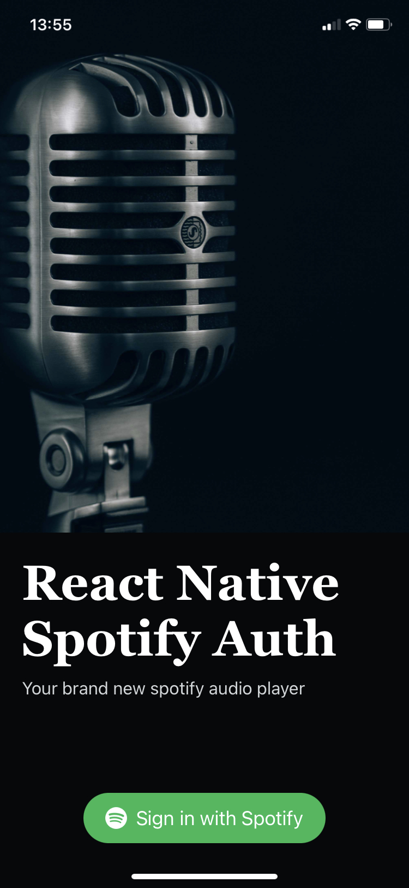
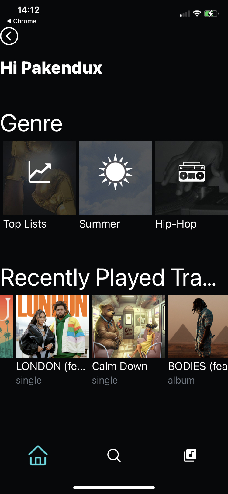

# React Native Spotify Auth

Spotify api authentication with React Native and Express (using Firebase)

### Description

  
  

## Features

- Authorize user with their Spotify account
- Get user recently played tracks
- Get categories
  
## Build and execution

### React Native App
Use the `.env.sample` to create a `.env` file with your Spotify credentials then run: 
  - `npm install` to install dependencies 
  - and `npm start` to start the metro.
  - For Android : `npm run android`
  - For iOS : `npm run ios`

### Launch the Express App (using Firebase)
- Create a firebase project with `Blaze plan`
- Use `firebase.json` and set the local ip address like this:  
  in case you want to launch on local.
- launch `npm install` to install all the dependencies
- Then run `npm run serve` to launch the firebase emulator
- Or run `npm run deploy` to deploy on firebase.

## TODO

- [ ] Add tests
- [ ] Implement library and search screen
- [ ] Refacto
- [ ] Implement track playing
- [ ] And more
